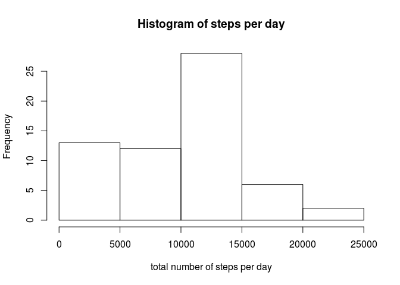
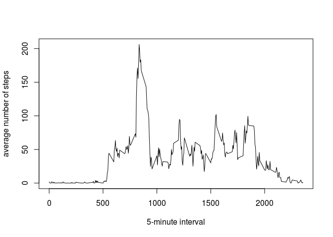
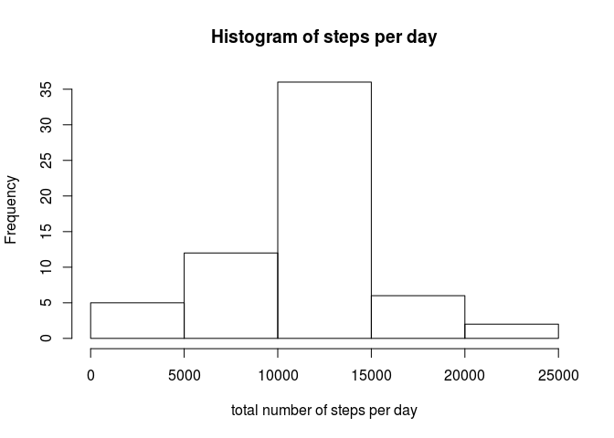
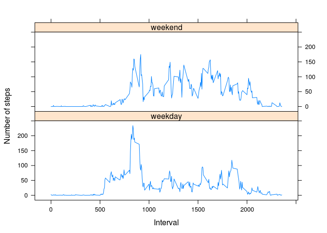

## Loading and preprocessing the data
Unzip data and load it into a variable.


```r
unzip("activity.zip")
activitydata <- read.csv("activity.csv")
```

## What is mean total number of steps taken per day?
Aggregate 
Calculate the total number of steps taken per day, make a histogram of the total number of steps taken each day and Calculate the mean and median of the total number of steps taken per day.


```r
stepsperday <- aggregate(activitydata$steps, list(activitydata$date), sum, na.rm = TRUE)
hist(stepsperday$x, xlab = "total number of steps per day", main = "Histogram of steps per day")
```

<!-- -->

```r
mean(stepsperday$x, na.rm = TRUE)
```

```
## [1] 9354.23
```

```r
median(stepsperday$x, na.rm = TRUE)
```

```
## [1] 10395
```

# What is the average daily activity pattern?
1. Make a time series plot of the 5-minute interval (x-axis) and the average number of steps taken, averaged across all days (y-axis).

```r
averagesteps <- aggregate(steps ~ interval, data = activitydata, mean, na.rm = TRUE)
plot(averagesteps$interval, averagesteps$steps, type = "l", xlab = "5-minute interval", ylab = "average number of steps")
```

<!-- -->

2. Which 5-minute interval, on average across all the days in the dataset, contains the maximum number of steps?

```r
averagesteps[which.max(averagesteps$steps),]
```

```
##     interval    steps
## 104      835 206.1698
```


## Imputing missing values
1. Calculate and report the total number of missing values in the dataset (i.e. the total number of rows with NAs)


```r
sum(is.na(activitydata$steps))
```

```
## [1] 2304
```


2. Devise a strategy for filling in all of the missing values in the dataset. The strategy does not need to be sophisticated. For example, you could use the mean/median for that day, or the mean for that 5-minute interval, etc: 
For each missing value the mean of that 5 minute interval is used.

3. Create a new dataset that is equal to the original dataset but with the missing data filled in.


```r
cleanactivitydata <- activitydata
for (i in 1:nrow(cleanactivitydata)) {
  currentrow <- activitydata[i,]
  if (is.na(currentrow$steps)){
    cleanactivitydata$steps[i] <- averagesteps$steps[averagesteps$interval == currentrow$interval]
  }
}
```


Make a histogram of the total number of steps taken each day and Calculate and report the mean and median total number of steps taken per day. 


```r
cleanstepsperday <- aggregate(cleanactivitydata$steps, list(cleanactivitydata$date), sum, na.rm = TRUE)
hist(cleanstepsperday$x, xlab = "total number of steps per day", main = "Histogram of steps per day")
```

<!-- -->

```r
mean(cleanstepsperday$x, na.rm = TRUE)
```

```
## [1] 10766.19
```

```r
median(cleanstepsperday$x, na.rm = TRUE)
```

```
## [1] 10766.19
```
Both mean and median differ from the previously calculated values.

## Are there differences in activity patterns between weekdays and weekends?

1. Create a new factor variable in the dataset with two levels – “weekday” and “weekend” indicating whether a given date is a weekday or weekend day.


```r
activitydata$day <- weekdays(as.POSIXlt(activitydata$date), abbreviate = TRUE)
for (i in 1:nrow(activitydata)) {
   currentrow <- activitydata[i,]
   if (currentrow$day == 'Sa' || currentrow$day == 'So'){
     activitydata$weekday[i] <- 'weekend'
   } else {
     activitydata$weekday[i] <- 'weekday'
   }
}
activitydata$weekday <- as.factor(activitydata$weekday)
```

2. Make a panel plot containing a time series plot (i.e. type = "l") of the 5-minute interval (x-axis) and the average number of steps taken, averaged across all weekday days or weekend days (y-axis). See the README file in the GitHub repository to see an example of what this plot should look like using simulated data.


```r
averagestepsweekday <- aggregate(steps ~ interval + weekday, data = activitydata, mean, na.rm = TRUE)

library(lattice)
xyplot(steps ~ interval | weekday, averagestepsweekday, type = "l", layout = c(1, 2), xlab = "Interval", ylab = "Number of steps")
```

<!-- -->
